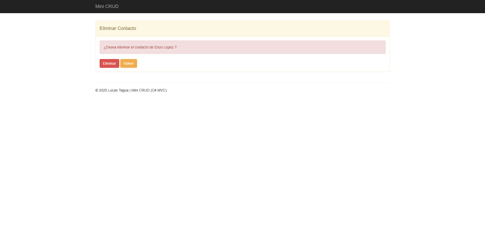

# MiniCRUD – C# MVC + SQL Server

Aplicación CRUD (Create, Read, Update, Delete) para la gestión de contactos, desarrollada en ASP.NET MVC con C#, Entity Framework y SQL Server.

## Características
- Alta, edición y eliminación de registros.
- Listado con paginación y búsqueda.
- Validación de formularios.
- Conexión a base de datos SQL Server.
- Arquitectura MVC.

## Tecnologías utilizadas
- **Lenguaje:** C#
- **Framework:** ASP.NET MVC
- **Base de datos:** SQL Server
- **ORM:** Entity Framework
- **Frontend:** HTML, CSS, Bootstrap

## Capturas de pantalla
**Listado de contactos:** 
**Agregar Contacto:** 
**Editar Contacto:** 
**Eliminar Contacto:** 

## Instalación
1. Clonar este repositorio.
2. Restaurar el archivo `DBCONTACTO.sql` en SQL Server.
3. Configurar la cadena de conexión en `Web.config`:
   ```xml
   <connectionStrings>
     <add name="cadena"
          providerName="System.Data.SqlClient"
          connectionString="Data Source=TU_SERVIDOR;Initial Catalog=DBCONTACTO;Integrated Security=True" />
   </connectionStrings>
